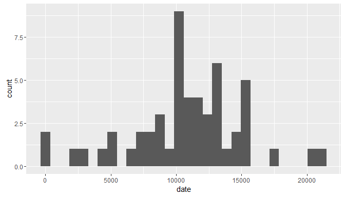
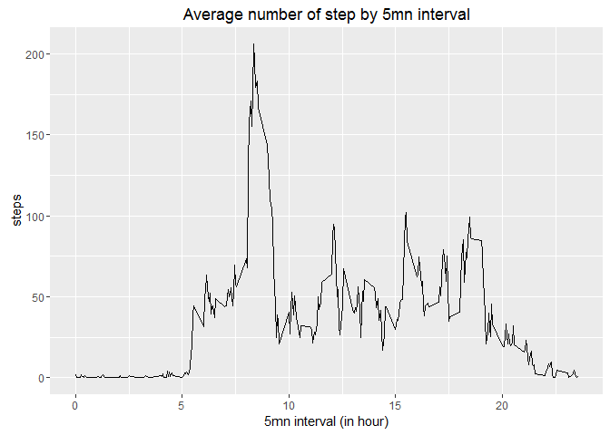
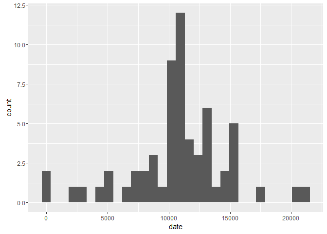
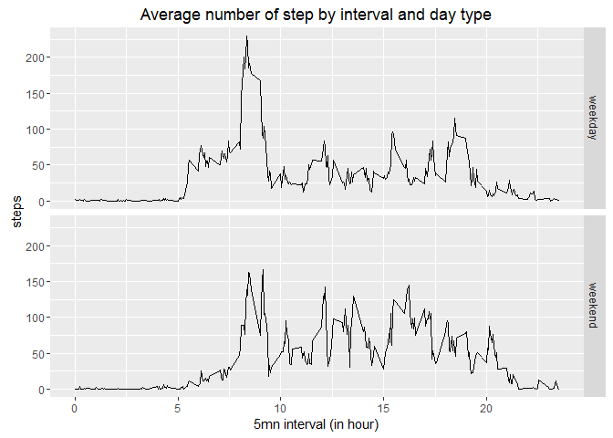

# Markdown & knitr - Peer-graded Assignment : Course Project 1
Jessy  
4 octobre 2016  

# Global 
### knitr global options 

```r
library(knitr)
knitr::opts_chunk$set(echo = TRUE,message=FALSE, warning=FALSE)
```

### Installing libraries to manipulate data 
These part of the program aims to install the library that will be necessary for the final project

```r
library(tidyr)
library(dplyr)
library(data.table)
library(ggplot2)
library("ggrepel")
library(lubridate)
```

# Loading and preprocessing the data

### Show any code that is needed to

1. Load the data (i.e. read.csv())


```r
activity <- read.csv("~/Coursera/Data science/Working directory/05 - Reproducible Research/activity.csv")
```

2. Process/transform the data (if necessary) into a format suitable for your analysis  
date column will be transform to a date format using ymd() function from lubridate


```r
activity$date <- ymd(as.character(activity$date))
activity$HMS <- hms(paste(activity$interval%/%100,":",activity$interval-(activity$interval%/%100)*100,":",0))
```

# What is mean total number of steps taken per day?

### For this part of the assignment, you can ignore the missing values in the dataset.

1. Calculate the total number of steps taken per day


```r
step_by_day <- aggregate(steps~date  ,data= activity, sum)
knitr::kable(summary(step_by_day))
```

          date                steps     
---  -------------------  --------------
     Min.   :2012-10-02   Min.   :   41 
     1st Qu.:2012-10-16   1st Qu.: 8841 
     Median :2012-10-29   Median :10765 
     Mean   :2012-10-30   Mean   :10766 
     3rd Qu.:2012-11-16   3rd Qu.:13294 
     Max.   :2012-11-29   Max.   :21194 

2. If you do not understand the difference between a histogram and a barplot, research the difference between them. Make a histogram of the total number of steps taken each day


```r
ggplot(step_by_day,aes(date))+geom_histogram(aes(steps),bins = 30)
```

<!-- -->


3. Calculate and report the mean and median of the total number of steps taken per day


The mean of the total number of steps taken per day is 10766.19  
The median of the total number of steps taken per day is 10765

# What is the average daily activity pattern?

1. Make a time series plot (i.e. type = "l") of the 5-minute interval (x-axis) and the average number of steps taken, averaged across all days (y-axis)

```r
average_step_by_5mn <- aggregate(steps ~ interval ,data= activity, mean)
ggplot(average_step_by_5mn,aes(x = interval/100,y= steps))+geom_line()+
        labs (title= "Average number of step by 5mn interval", x="5mn interval (in hour)")
```

<!-- -->

2. Which 5-minute interval, on average across all the days in the dataset, contains the maximum number of steps?

```r
max_average_number_of_steps <- average_step_by_5mn[which(average_step_by_5mn$steps == max(average_step_by_5mn$steps, na.rm = TRUE)), ]
```

The 5_minute interval that contains the maximum number of steps on average cross all days is 835

# Imputing missing values

### Note that there are a number of days/intervals where there are missing values (coded as NA). The presence of missing days may introduce bias into some calculations or summaries of the data.

1. Calculate and report the total number of missing values in the dataset (i.e. the total number of rows with NAs)

```r
total_rows_with_NAs <-  nrow(activity)-sum(complete.cases(activity))
```

The total number of missing values in the dataset is 2304  


2. Devise a strategy for filling in all of the missing values in the dataset. The strategy does not need to be sophisticated. For example, you could use the mean/median for that day, or the mean for that 5-minute interval, etc.

All missing values in the dataset will be replaced by the mean of the corresponding 5-minutes interval


```r
activity$modify<- is.na(activity$steps)
activity <-merge(activity,average_step_by_5mn,by = "interval" )
activity$steps.x[activity$modify] <- activity$steps.y[activity$modify]
```


3. Create a new dataset that is equal to the original dataset but with the missing data filled in.

```r
activity_new<- data.frame(interval=activity$interval,steps = activity$steps.x,date=as.Date(activity$date))
knitr::kable(summary(activity_new))
```

        interval          steps             date          
---  ---------------  ---------------  -------------------
     Min.   :   0.0   Min.   :  0.00   Min.   :2012-10-01 
     1st Qu.: 588.8   1st Qu.:  0.00   1st Qu.:2012-10-16 
     Median :1177.5   Median :  0.00   Median :2012-10-31 
     Mean   :1177.5   Mean   : 37.38   Mean   :2012-10-31 
     3rd Qu.:1766.2   3rd Qu.: 27.00   3rd Qu.:2012-11-15 
     Max.   :2355.0   Max.   :806.00   Max.   :2012-11-30 

```r
knitr::kable(head(activity_new))
```


 interval      steps  date       
---------  ---------  -----------
        0   1.716981  2012-10-01 
        0   0.000000  2012-11-23 
        0   0.000000  2012-10-28 
        0   0.000000  2012-11-06 
        0   0.000000  2012-11-24 
        0   0.000000  2012-11-15 


4. Make a histogram of the total number of steps taken each day and Calculate and report the mean and median total number of steps taken per day. Do these values differ from the estimates from the first part of the assignment? What is the impact of imputing missing data on the estimates of the total daily number of steps?

```r
total_step_by_day <- aggregate(steps ~ date ,data= activity_new, sum)
ggplot(total_step_by_day,aes(date))+geom_histogram(aes(steps),bins = 30)
```

<!-- -->

```r
mean_before_correction <- mean(step_by_day$steps)
mean_after_correction <-mean(total_step_by_day$steps)
median_before_correction <- median(step_by_day$steps)
median_after_correction <- median(total_step_by_day$steps)
```

The mean of before data set correction is 10766.19  
The mean of after data set correction (without NA) is 10766.19    

The median of before data set correction is 10765      
The median of after data set correction (without NA) is 10766.19 

#### Conclusion : as missing values were replaced by the mean of existing values, there is no change in the mean before and after correction while impact on median is visible

# Are there differences in activity patterns between weekdays and weekends?

### For this part the weekdays() function may be of some help here. Use the dataset with the filled-in missing values for this part.

1. Create a new factor variable in the dataset with two levels – “weekday” and “weekend” indicating whether a given date is a weekday or weekend day.


```r
week_days <- c("lundi","mardi","mercredi","jeudi","vendredi")
weekend_days <- c("samedi","dimanche")
day_type <- weekdays(activity_new$date) %in% week_days
activity_new$day_type[day_type]= "weekday" 
activity_new$day_type[!(day_type)]= "weekend"
activity_new$day_type <- as.factor(activity_new$day_type)
knitr::kable(head(activity_new))
```


 interval      steps  date         day_type 
---------  ---------  -----------  ---------
        0   1.716981  2012-10-01   weekday  
        0   0.000000  2012-11-23   weekday  
        0   0.000000  2012-10-28   weekend  
        0   0.000000  2012-11-06   weekday  
        0   0.000000  2012-11-24   weekend  
        0   0.000000  2012-11-15   weekday  

2. Make a panel plot containing a time series plot (i.e. type = "l") of the 5-minute interval (x-axis) and the average number of steps taken, averaged across all weekday days or weekend days (y-axis). See the README file in the GitHub repository to see an example of what this plot should look like using simulated data.


```r
average_step_by_5mn_daytype <- aggregate(steps ~ interval + day_type ,data= activity_new, mean)
ggplot(data = average_step_by_5mn_daytype, aes(x= interval/100, y = steps))+geom_line()+facet_grid(day_type~.)+
        labs (title= "Average number of step by interval and day type", x="5mn interval (in hour)")
```

<!-- -->
